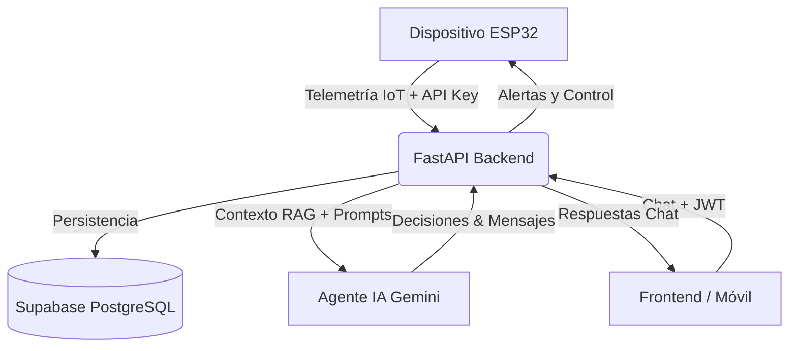

# 🚜 AgroNexus AI: Backend de Agricultura de Precisión IoT

[](https://www.python.org/)
[](https://fastapi.tiangolo.com/)
[](https://supabase.com/)
[](https://ai.google.dev/)

AgroNexus AI es un backend inteligente, orquestado y asíncrono para gestionar invernaderos de precisión. Su motor central está basado en FastAPI y cuenta con la IA de **Google Gemini** impulsada por un módulo **RAG Dinámico**. Está optimizado para tomar decisiones proactivas sobre telemetría IoT de dispositivos ESP32, asegurando despliegues Serverless veloces y altamente escalables.

## 🏗️ Arquitectura del Sistema

El flujo completo del backend interactúa con múltiples actores (ESP32, Frontend, Supabase, Gemini):



**Principios de Arquitectura:**
- **Inyección RAG Dinámica:** Los fragmentos de contexto (`crops.md`, `climate.md`, etc.) se inyectan en base a intención, reduciendo drásticamente el costo de tokens.
- **Memoria de Contexto Comprimida:** (Sliding Window Compression).
- **Asincronía Total:** Orquestación veloz mediante `asyncio`.
- **Stateless Serverless:** Persistencia delegada a Supabase para ser compatible con AWS Lambda / Vercel Functions.

---

## 🛠️ Instalación Paso a Paso

1. **Clonar e Ingresar al Proyecto**
   ```bash
   git clone https://github.com/LNieto-V/agronexus_ai.git
   cd agronexus_ai
   ```

2. **Instalar Dependencias** (Se recomienda `uv` para mayor velocidad, o `pip`)
   ```bash
   uv sync
   # O alternativamente: pip install -r requirements.txt
   ```

3. **Configurar el Entorno**
   ```bash
   cp .env.example .env
   ```
   Rellena `.env` con tus claves de Gemini y Supabase.

4. **Variables de Entorno (`.env`)**
   | Variable | Descripción |
   |----------|-------------|
   | `GEMINI_API_KEY` | Clave de Google AI Studio |
   | `SUPABASE_URL` | URL del proyecto Supabase (https://xyz.supabase.co) |
   | `SUPABASE_KEY` | Public Anon Key de Supabase |
   | `SUPABASE_SERVICE_ROLE_KEY` | Secret Key para backend (bypass RLS) |
   | `SUPABASE_JWT_SECRET` | Para autenticar a los usuarios del frontend |

5. **Acelerar el Servidor**
   ```bash
   uv run uvicorn app.main:app --reload
   ```

---

## 🗄️ Configuración de Base de Datos (Supabase)

Debes ejecutar el archivo **`schema.sql`** en la consola SQL de tu proyecto Supabase.
Las tablas que se crearán son obligatorias para el circuito asíncrono y los bloqueos RLS:

- `sensor_data`: Para todo el flujo de IoT (Lecturas físicas).
- `chat_history`: Para persistir las alucinaciones limitadas del Agente y su memoria.
- `api_keys`: Hardware auth por SHA-256.
- `system_state`: Estado de modos automáticos y manuales.

*(El RLS limitará la visualización de los datos únicamente a los dueños `auth.uid() = user_id`).*

---

## 📡 Endpoints: Ejemplo de Uso

### Interfaz del Asistente (Chat)
Endpoint protegido para chatear con Gemini. Requiere un Bearer token.
```bash
curl -X POST http://localhost:8000/chat \
  -H "Authorization: Bearer TU_JWT" \
  -H "Content-Type: application/json" \
  -d '{"message": "¿Cómo está mi clima hoy y activo el riego?"}'
```

### Nodo de Prueba (/chat/test)
Diseñado para la evaluación de la rúbrica y validación de prompts. No requiere Bearer Token.
```bash
curl -X POST http://localhost:8000/chat/test \
  -H "Content-Type: application/json" \
  -d '{"message": "Dime cómo está estructurado tu backend y qué stack usas."}'
```

### Telemetría de Dispositivos (ESP32)
Simula el ESP32 enviando temperatura y humedad. Requiere la API key autogenerada por el User.
```bash
curl -X POST http://localhost:8000/iot/telemetry \
  -H "X-API-Key: hw_key_example123" \
  -H "Content-Type: application/json" \
  -d '{"temperature": 28.5, "humidity": 65.0, "light": 800, "ph": 6.2, "ec": 1.5}'
```

---

## 🧠 Flujo de la IA y Prompting Eficiente (RAG)

El bot de AgroNexus no utiliza la misma ventana de contexto pesada siempre. Se divide en:

1. **Jerarquía del Prompt:** Se inyectan primero las *Reglas estrictas* (`rules.md`), luego el *Estado en tiempo real* (IoT), luego la *Memoria comprimida* (Supabase).
2. **Dynamic Knowledge (RAG segmentado):** La base de conocimiento se evaluó dinámicamente. Si mencionas "tomate", inyecta `crops.md`. Si mencionas "riego", inyecta `irrigation.md`. Esto **reduce el costo de la API** al no enviar grandes librerías estáticas en cada request.
3. **Manejo de Tokens:** Ampliado a `4096 tokens` bajo el nuevo modelo con resiliencia de Errores `429` (Quota Exhausted). 
