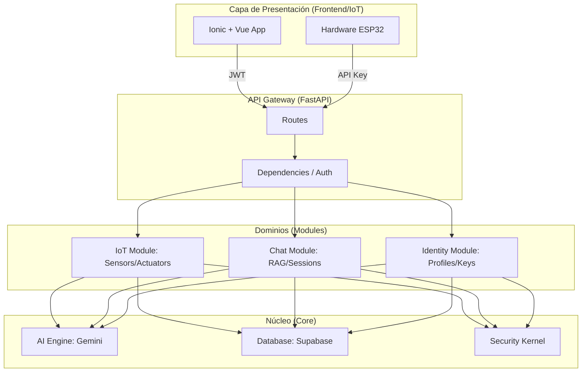

# 🚜 AgroNexus AI: Backend de Agricultura de Precisión IoT

[](https://www.python.org/)
[](https://fastapi.tiangolo.com/)
[](https://supabase.com/)
[](https://ai.google.dev/)

**AgroNexus AI** es un ecosistema backend de alto rendimiento diseñado para la gestión inteligente de invernaderos. Basado en una arquitectura **DDD-Lite (Domain-Driven Design Lite)**, desacopla la lógica de negocio del hardware y la infraestructura, permitiendo una orquestación asíncrona entre telemetría IoT, inteligencia artificial (Google Gemini) y persistencia en la nube (Supabase).

---

## 🏗️ Arquitectura Modular (DDD-Lite)

El sistema está organizado en dominios independientes, lo que permite escalar cada parte de la operación agrícola (IoT, Chat, Identidad) de forma aislada.



### 📂 Estructura del Proyecto
```text
agronexus_ai/
├── app/
│   ├── api/            # Capa de Entrada: Routers y Dependencias (Auth/DI)
│   │   └── routes/     # Endpoints de cada dominio
│   ├── core/           # Shared Kernel: AI (Prompts), Database, Security
│   ├── modules/        # Capa de Dominio: Servicios y Repositorios (Lógica pura)
│   │   ├── iot/        # Gestión de telemetría y actuadores
│   │   ├── chat/       # Orquestación de IA y sesiones RAG
│   │   └── identity/   # Gestión de perfiles, roles y llaves de seguridad
│   ├── schemas/        # DTOs: Modelos Pydantic para validación de datos
│   └── main.py         # Punto de entrada y configuración de FastAPI
└── database/           # Migraciones y scripts SQL (Supabase)
```

---

## 🚀 Instalación y Despliegue

### 1. Requisitos Previos
*   **Python 3.12+**
*   **UV** (Gestor de paquetes recomendado)
*   Cuentas en **Google AI Studio** y **Supabase**.

### 2. Configuración Inicial
```bash
# Sincronizar el entorno de desarrollo
uv sync

# Configurar variables de entorno
cp .env.example .env
```

| Variable | Responsabilidad |
|----------|-----------------|
| `SUPABASE_JWT_SECRET` | Validación de tokens de usuario (Auth). |
| `SUPABASE_SERVICE_ROLE_KEY` | Bypass de RLS para operaciones administrativas. |
| `GEMINI_API_KEY` | Cerebro de la IA (Orquestador). |

---

## 🔐 Seguridad y Control de Acceso

Implementamos un modelo de **Confianza Cero** distribuido en tres capas:

1.  **Autenticación Humana (JWT)**: Acceso a la App mediante tokens de Supabase Auth.
2.  **Autenticación de Hardware (API Keys)**: Los dispositivos usan llaves cifradas (SHA-256).
    *   **Política Crítica**: Las llaves con permisos de **escritura** (`write`) deben estar vinculadas permanentemente a un `zone_id` específico.
3.  **Row Level Security (RLS)**: Cada dato en la base de datos pertenece estrictamente a un `user_id`, garantizando aislamiento total.

---

## 💬 Inteligencia Artificial y RAG Dinámico

El agrónomo virtual de AgroNexus no es un simple chat. Es un orquestador que:
*   **Consume Contexto IoT**: Lee el estado actual del invernadero antes de responder.
*   **Toma Acciones**: Puede emitir comandos a actuadores (Bomba, Luces) en formato JSON.
*   **Historial Aislado**: Cada sesión de chat (`session_id`) mantiene su propio hilo de pensamiento para evitar interferencias entre diferentes cultivos o consultas.

---

## 📡 Endpoints de la API (v1)

### 🚜 Agricultura e IoT
- `POST /api/iot/telemetry`: Recepción de datos de hardware (ESP32).
- `GET /api/iot/stream`: Stream SSE para actualización en tiempo real de la UI.
- `GET /api/zones`: CRUD de invernaderos y áreas de cultivo.
- `GET /api/dashboard/stats`: Analíticas agregadas de productividad.

### 💬 Asesoría IA
- `POST /api/chat`: Interacción con el agrónomo (Soporta `session_id`).
- `GET /api/conversations`: Gestión de hilos de chat y memoria histórica.

### 🔐 Identidad y Acceso
- `PATCH /api/auth/profile`: Gestión de perfil (Nombre, Rol).
- `POST /api/auth/keys`: Generación de llaves para nuevos dispositivos.

---

## 🧪 Validación del Sistema
El proyecto incluye una suite de pruebas para simular tráfico real sin hardware físico:
```bash
# Simulación de telemetría masiva
python tests/test_iot_bulk.py

# Validación completa de integración (End-to-End)
python tests/test_transmission.py
```

---
*Desarrollado para la agricultura inteligente por el equipo de **AgroNexus AI**.*
