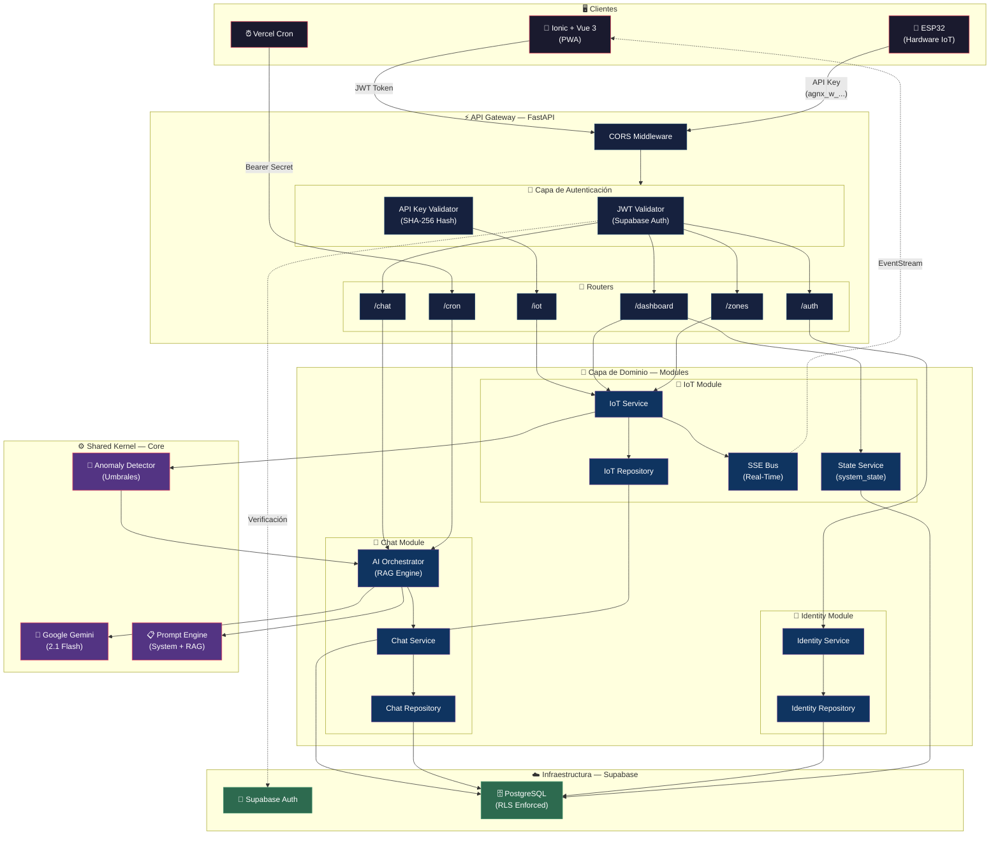
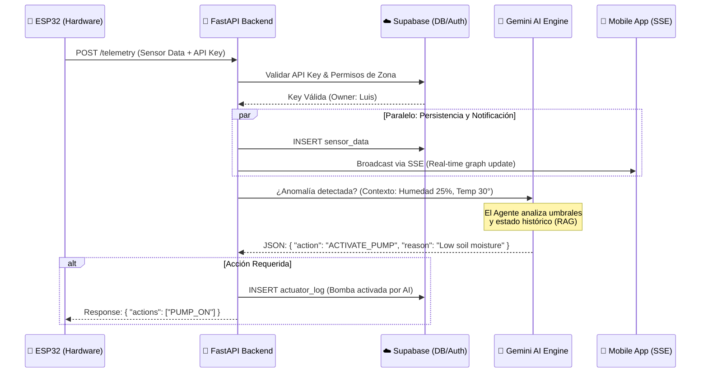

# 🚜 AgroNexus AI: Backend de Agricultura de Precisión IoT

[](https://www.python.org/)
[](https://fastapi.tiangolo.com/)
[](https://supabase.com/)
[](https://ai.google.dev/)

**AgroNexus AI** es un ecosistema backend de alto rendimiento diseñado para la gestión inteligente de invernaderos. Basado en una arquitectura **DDD-Lite (Domain-Driven Design Lite)**, desacopla la lógica de negocio del hardware y la infraestructura, permitiendo una orquestación asíncrona entre telemetría IoT, inteligencia artificial (Google Gemini) y persistencia en la nube (Supabase).

---

## 🏗️ Arquitectura Modular (DDD-Lite)

El sistema está organizado en dominios independientes, lo que permite escalar cada parte de la operación agrícola (IoT, Chat, Identidad) de forma aislada.



### 📂 Estructura del Proyecto
```text
agronexus_ai/
├── app/
│   ├── api/            # Capa de Entrada: Routers y Dependencias (Auth/DI)
│   │   └── routes/     # Endpoints de cada dominio
│   ├── core/           # Shared Kernel: AI (Prompts), Database, Security
│   ├── modules/        # Capa de Dominio: Servicios y Repositorios (Lógica pura)
│   │   ├── iot/        # Gestión de telemetría y actuadores
│   │   ├── chat/       # Orquestación de IA y sesiones RAG
│   │   └── identity/   # Gestión de perfiles, roles y llaves de seguridad
│   ├── schemas/        # DTOs: Modelos Pydantic para validación de datos
│   └── main.py         # Punto de entrada y configuración de FastAPI
└── database/           # Migraciones y scripts SQL (Supabase)
```

---

## 🚀 Instalación y Despliegue

### 1. Requisitos Previos
*   **Python 3.12+**
*   **UV** (Gestor de paquetes recomendado)
*   Cuentas en **Google AI Studio** y **Supabase**.

### 2. Configuración Inicial
```bash
# Sincronizar el entorno de desarrollo
uv sync

# Configurar variables de entorno
cp .env.example .env
```

| Variable | Responsabilidad |
|----------|-----------------|
| `SUPABASE_JWT_SECRET` | Validación de tokens de usuario (Auth). |
| `SUPABASE_SERVICE_ROLE_KEY` | Bypass de RLS para operaciones administrativas. |
| `GEMINI_API_KEY` | Cerebro de la IA (Orquestador). |

### 3. Base de Datos (Replicable)

El esquema completo de la base de datos es **idempotente** y se puede replicar en cualquier instancia de Supabase ejecutando un único archivo SQL:

```bash
# Ejecutar en el SQL Editor de Supabase (Dashboard → SQL Editor → New Query)
database/migrations/schema_v1.sql
```

Este script crea automáticamente:

| # | Tabla | Propósito |
|---|-------|-----------|
| 1 | `sensor_data` | Telemetría IoT (ESP32). |
| 2 | `conversations` | Sesiones del sistema multi-chat. |
| 3 | `chat_history` | Mensajes persistentes (usuario ↔ IA). |
| 4 | `api_keys` | Autenticación de hardware (SHA-256). |
| 5 | `system_state` | Estado y modo de operación por usuario. |
| 6 | `profiles` | Perfiles con roles (owner, agronomist, viewer). |
| 7 | `actuator_log` | Historial de acciones de actuadores. |
| 8 | `alert_thresholds` | Umbrales personalizados de alerta. |
| 9 | `zones` | Invernaderos y áreas de cultivo. |
| 10 | `maintenance_log` | Registro de mantenimiento. |

Además configura:
- 🔒 **Row Level Security (RLS)** en todas las tablas.
- ⚡ **Trigger automático** que inicializa perfil, estado y umbrales al registrar un usuario.
- 📇 **Índices optimizados** para consultas por `user_id` y `created_at`.

> [!TIP]
> El script usa `CREATE TABLE IF NOT EXISTS`, `DROP POLICY IF EXISTS` y bloques `DO $$` condicionales, por lo que puede ejecutarse múltiples veces sin errores.

---

## 🔐 Seguridad y Control de Acceso

Implementamos un modelo de **Confianza Cero** distribuido en tres capas:

1.  **Autenticación Humana (JWT)**: Acceso a la App mediante tokens de Supabase Auth.
2.  **Autenticación de Hardware (API Keys)**: Los dispositivos usan llaves cifradas (SHA-256).
    *   **Política Crítica**: Las llaves con permisos de **escritura** (`write`) deben estar vinculadas permanentemente a un `zone_id` específico.
3.  **Row Level Security (RLS)**: Cada dato en la base de datos pertenece estrictamente a un `user_id`, garantizando aislamiento total.

---

## 💬 Inteligencia Artificial y RAG Dinámico

El agrónomo virtual de AgroNexus no es un simple chat. Es un orquestador que:
*   **Consume Contexto IoT**: Lee el estado actual del invernadero antes de responder.
*   **Toma Acciones**: Puede emitir comandos a actuadores (Bomba, Luces) en formato JSON.
*   **Historial Aislado**: Cada sesión de chat (`session_id`) mantiene su propio hilo de pensamiento para evitar interferencias entre diferentes cultivos o consultas.

### 🔄 Ciclo de Telemetría e Intervención IA



---

## 🖥️ Ejecución Local

```bash
# Iniciar el servidor de desarrollo
uv run uvicorn app.main:app --reload
```

Una vez corriendo, la documentación interactiva está disponible en:

| Recurso | URL |
|---------|-----|
| **Swagger UI** | [http://localhost:8000/api/docs](http://localhost:8000/api/docs) |
| **ReDoc** | [http://localhost:8000/api/redoc](http://localhost:8000/api/redoc) |
| **OpenAPI JSON** | [http://localhost:8000/api/openapi.json](http://localhost:8000/api/openapi.json) |

> [!NOTE]
> Las URLs de documentación están bajo el prefijo `/api` para mantener consistencia con el resto de los endpoints.

---

## 📡 Endpoints de la API (v1)

### ⚙️ Sistema
| Método | Ruta | Descripción |
|--------|------|-------------|
| `GET` | `/api/health` | Health check del servidor. |

### 📡 IoT y Telemetría
| Método | Ruta | Auth | Descripción |
|--------|------|------|-------------|
| `POST` | `/api/iot/telemetry` | API Key (write) | Recepción de datos de hardware (ESP32). |
| `GET` | `/api/iot/stream` | JWT | Stream SSE para actualización en tiempo real. |

### 📊 Dashboard
| Método | Ruta | Auth / Rol | Descripción |
|--------|------|------------|-------------|
| `GET` | `/api/dashboard/latest` | JWT | Últimos datos de sensores (soporta `?zone_id=`). |
| `GET` | `/api/dashboard/history` | JWT | Historial reciente de telemetría. |
| `GET` | `/api/dashboard/state` | JWT | Estado interno del sistema (modo, actuadores). |
| `POST` | `/api/dashboard/mode` | owner, agronomist | Cambia el modo de operación (AUTO/MANUAL). |
| `GET` | `/api/dashboard/actuator-log` | owner, agronomist | Historial de acciones de actuadores (paginado). |
| `GET` | `/api/dashboard/stats` | JWT | Estadísticas agregadas (min/max/avg). |
| `GET` | `/api/dashboard/export` | owner, agronomist | Exporta historial de sensores a CSV. |
| `GET` | `/api/dashboard/maintenance` | JWT | Historial de mantenimiento. |
| `GET` | `/api/dashboard/thresholds` | JWT | Obtiene umbrales de alerta. |
| `PUT` | `/api/dashboard/thresholds` | owner | Configura umbrales de alerta. |

### 🌱 Zonas de Cultivo
| Método | Ruta | Auth | Descripción |
|--------|------|------|-------------|
| `GET` | `/api/zones/` | JWT | Lista todos los invernaderos/zonas del usuario. |
| `POST` | `/api/zones/` | JWT | Crea un nuevo invernadero o zona. |
| `PATCH` | `/api/zones/{zone_id}` | JWT | Actualiza una zona existente. |
| `DELETE` | `/api/zones/{zone_id}` | JWT | Elimina una zona de cultivo. |

### 💬 Chat e IA
| Método | Ruta | Auth / Rol | Descripción |
|--------|------|------------|-------------|
| `POST` | `/api/chat` | owner, agronomist | Interacción con el agrónomo IA (soporta `session_id`). |
| `GET` | `/api/chat/history` | JWT | Historial de mensajes (paginado, filtrable por sesión). |
| `POST` | `/api/chat/test` | *Ninguna* | Endpoint de prueba sin auth para evaluación/QA. |
| `GET` | `/api/conversations` | JWT | Lista todas las conversaciones del usuario. |
| `POST` | `/api/conversations` | owner, agronomist | Crea una nueva sesión de chat. |
| `PATCH` | `/api/conversations/{session_id}` | owner, agronomist | Renombra una conversación. |
| `DELETE` | `/api/conversations/{session_id}` | owner, agronomist | Elimina una conversación y sus mensajes. |

### 🔐 Identidad y Acceso
| Método | Ruta | Auth | Descripción |
|--------|------|------|-------------|
| `POST` | `/api/auth/register` | *Ninguna* | Registro de nuevo usuario. |
| `POST` | `/api/auth/login` | *Ninguna* | Login (devuelve `access_token`). |
| `GET` | `/api/auth/me` | JWT | Devuelve el usuario autenticado actual. |
| `PATCH` | `/api/auth/profile` | JWT | Actualiza perfil (nombre, rol). |
| `GET` | `/api/auth/keys` | JWT | Lista las API Keys del usuario (metadatos). |
| `POST` | `/api/auth/keys` | JWT | Genera una nueva API Key (`?key_type=read\|write`). |
| `DELETE` | `/api/auth/keys/{key_type}` | JWT | Revoca una API Key específica. |

### 🕐 Cron (Interno)
| Método | Ruta | Descripción |
|--------|------|-------------|
| `GET` | `/api/cron/daily-summary` | Genera resumen proactivo de salud agrícola (Vercel Cron). |

---

## 🧪 Validación del Sistema
El proyecto incluye una suite de pruebas para simular tráfico real sin hardware físico:
```bash
# Simulación de telemetría masiva
python tests/test_iot_bulk.py

# Validación completa de integración (End-to-End)
python tests/test_transmission.py
```

---
*Desarrollado para la agricultura inteligente por el equipo de **AgroNexus AI**.*
