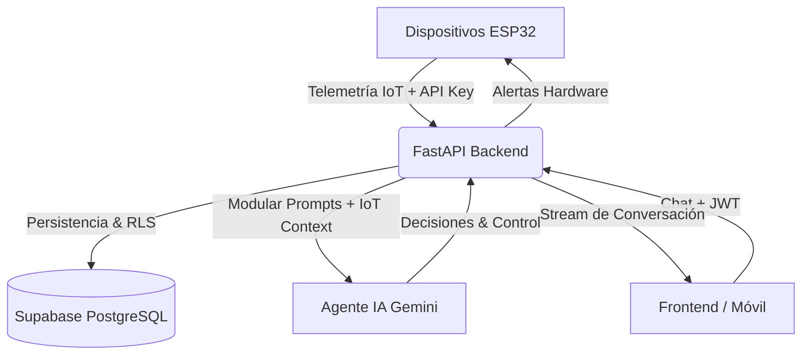

# 🚜 AgroNexus AI: Backend de Agricultura de Precision IoT

[](https://www.python.org/)
[](https://fastapi.tiangolo.com/)
[](https://supabase.com/)
[](https://ai.google.dev/)
[](https://opensource.org/licenses/MIT)

**AgroNexus AI** es un backend inteligente, orquestado y asíncrono diseñado para la gestión de invernaderos de alta precisión. Impulsado por **FastAPI** y **Google Gemini**, el sistema actúa como el cerebro proactivo de la operación agrícola, procesando telemetría IoT desde equipos ESP32 y ofreciendo asesoría experta mediante un motor **RAG Dinámico** de alto rendimiento.

---

## 🏗️ Arquitectura e Infraestructura

El sistema utiliza un modelo de orquestación asíncrona para manejar múltiples flujos de datos en paralelo sin bloqueos de E/S.



### 📂 Estructura del Proyecto
```text
agronexus_ai/
├── app/
│   ├── api/            # Rutas y Endpoints (v1)
│   ├── core/           # Configuración, Seguridad y Lógica de Prompts (AI)
│   ├── models/         # Esquemas Pydantic para APIs
│   ├── repositories/   # Capa de Acceso a Datos (Supabase Integration)
│   └── services/       # Lógica de Negocio (IoT, IA Orchestration)
├── .agent/             # Cerebro de la IA (Skills, Reglas, Contexto)
├── schema.sql          # Esquema de Base de Datos PostgreSQL
├── requirements.txt    # Dependencias del sistema
└── .env                # Variables de entorno secretas
```

---

## 🚀 Instalación y Despliegue

### 1. Requisitos Previos
*   **Python 3.12+**
*   **UV** (Recomendado para gestión de paquetes ultra-rápida) o `pip`.
*   Cuenta de **Google AI Studio** (Gemini API).
*   Proyecto en **Supabase** (PostgreSQL + Auth).

### 2. Configuración Rápida
```bash
# Sincronizar entorno y dependencias
uv sync

# Configurar variables
cp .env.example .env
```

| Variable | Descripción |
|----------|-------------|
| `GEMINI_API_KEY` | Clave de Google AI Studio. |
| `SUPABASE_URL` | URL de tu proyecto Supabase. |
| `SUPABASE_KEY` | Public Anon Key. |
| `SUPABASE_SERVICE_ROLE_KEY` | Secret Key (Necesaria para bypass RLS en el backend). |
| `SUPABASE_JWT_SECRET` | Secreto para validación de tokens de usuario. |

### 3. Iniciar el Motor
```bash
uv run uvicorn app.main:app --reload
```

---

## 💬 Sistema de Chat Multi-Sesión (Conversations)

A diferencia de un chat global, AgroNexus implementa hilos de conversación aislados que permiten mantener el contexto RAG específico para cada tópico o invernadero.

*   **Identificación por `session_id`**: Cada conversación en la tabla `conversations` agrupa mensajes en `chat_history`.
*   **Aislamiento de Memoria**: La IA solo consume el historial de la sesión activa para evitar "alucinaciones" cruzadas.
*   **Chat Global**: Si no se provee `session_id`, el sistema opera en un modo de chat general.

### Endpoints Principales:
- `GET /conversations`: Lista todas las sesiones del usuario activo.
- `POST /conversations`: Inicia un nuevo hilo de chat.
- `PATCH /conversations/{id}`: Renombra el título del chat.
- `POST /chat`: Envía un mensaje (soporta `session_id` opcional).

---

## 🔒 Seguridad Híbrida y RLS

Implementamos un modelo de seguridad de "Confianza Cero" para proteger tanto a los usuarios como al hardware físico.

1.  **Autenticación de Usuarios (JWT)**: Todos los endpoints `v1` para la APP requieren un Bearer Token validado contra el `SUPABASE_JWT_SECRET`.
2.  **Autenticación IoT (API Keys)**: Los ESP32 utilizan llaves SHA-256 almacenadas en la base de datos.
    -   `POST /auth/keys`: Genera llaves maestras con permisos de solo lectura o escritura.
3.  **Row Level Security (RLS)**: Cada fila en PostgreSQL está protegida por políticas de usuario (`auth.uid() = user_id`), asegurando que ningún usuario pueda acceder a datos de sensor o chats ajenos.

---

## 🧠 Inteligencia Artificial Modular (RAG Dinámico)

El Agente **no** carga todo el conocimiento en cada request. Utiliza una inyección modular basada en el contenido de `.agent/skills/`:

*   **`prompt.md`**: Define la personalidad experta en AgTech y el ADN técnico del sistema.
*   **`rules.md`**: Reglas estrictas de seguridad (no mencionar keys) y formato obligatorio de salida (JSON para control de actuadores).
*   **`devices.md`**: Inventario actualizado de hardware (FAN, LIGHT, IRRIGATION) que el bot puede manipular.

---

---

## 🧪 Testing — Transmisión de Datos IoT

El directorio `tests/` incluye scripts listos para validar la capa de comunicación del backend sin necesidad de hardware físico.

### Configuración

Copia las variables en tu `.env` (o expórtalas en la terminal):

```bash
export AGRONEXUS_URL="http://localhost:8000"   # o tu URL de Vercel
export AGRONEXUS_WRITE_KEY="agnx_w_..."        # POST /auth/keys?key_type=write
export AGRONEXUS_JWT="eyJhbGc..."              # Token JWT de Supabase
```

### `tests/test_iot_bulk.py` — Transmisión masiva de sensores

Envía **80 lecturas de telemetría** simuladas al endpoint `POST /iot/telemetry` usando la API Key (`agnx_w_...`). Muestra barra de progreso en tiempo real, acciones del agente IA y alertas detectadas.

```bash
python tests/test_iot_bulk.py
```

Resultado esperado:
```
✔ #80  T=22.8°C  H=69.7%  pH=6.6  [████████████████████████████████████████] 100% (80/80)
Enviados: 80 | Exitosos: 80 | Fallidos: 0
```

### `tests/test_transmission.py` — Suite completa de endpoints

Ejecuta 9 suites de prueba cubriendo todos los flujos del sistema: health check, chat público, conversaciones JWT, historial, dashboard, telemetría IoT y validación de seguridad.

```bash
python tests/test_transmission.py
```

| Requiere | Variable |
|----------|----------|
| Endpoint IoT (`/iot/telemetry`) | `AGRONEXUS_WRITE_KEY` |
| Endpoints de usuario (`/chat`, `/conversations`) | `AGRONEXUS_JWT` |
| Sin autenticación (`/chat/test`, `/system/health`) | — |

---

## 🛠️ Guía de Troubleshooting (FAQ)

> [!WARNING]
> **Error `PGRST205` o 404 en /conversations**: Esto indica que la tabla no existe en Supabase. Asegúrate de haber ejecutado **todo** el contenido de `schema.sql` en tu SQL Editor.

> [!CAUTION]
> **Error 401 (Invalid Token)**: Verifica que el `SUPABASE_JWT_SECRET` en tu `.env` coincida exactamente con el de la pestaña *API Settings* en Supabase.

> [!TIP]
> **Lentitud en Respuestas**: El sistema es asíncrono, pero Gemini tiene cuotas. Si recibes errores `429`, revisa el uso del API Key en Google AI Studio.

---

## 🤝 Contribuciones y Desarrollo

Para reportar bugs o solicitar nuevas integraciones de hardware (sensores de EC, CO2, etc.), por favor abre un **Issue** o envía un **Pull Request**.

---
*Desarrollado con ❤️ para el futuro de la agricultura sostenible por el equipo de AgroNexus.*
